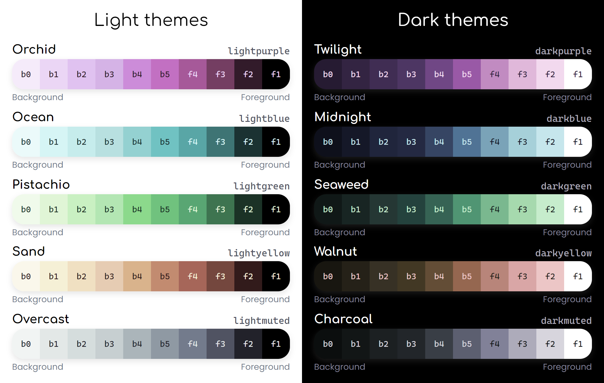

## [View this README rendered with Tropical](https://src.simplecyber.org/v2)

# The Tropical CSS and Javascript Library
This README contains everything you need to know to make the most out of the Tropical CSS and Javascript library.

You can see a live demo of most of Tropical's elements on the [demo page](test.html).

## What's in the box
* 10 different colour themes
* Paragraphs, headings, lists, blockquotes, tables, and other text elements
* Handy CSS utility classes and Javascript functions
* Buttons in various colours and sizes with optional icons
* Textboxes and textareas
* Range sliders
* Progress bars
* Code blocks with syntax highlighting
* Notices
* Custom context menus
* Custom popups
* Custom toast notifications
* Custom tooltips
* Loading spinners
* Custom video and audio players

## Adding Tropical to your site
To add Tropical to your site, add the following lines to your HTML `<head>`:

```html
<link rel="stylesheet" href="https://src.simplecyber.org/v2/base.css">
<link rel="stylesheet" href="https://src.simplecyber.org/v2/themes.css">
<script defer src="https://src.simplecyber.org/lib/tabbable.min.js"></script>
<script defer src="https://src.simplecyber.org/lib/focus-trap.min.js"></script>
<script defer src="https://src.simplecyber.org/lib/prism.min.js"></script>
<script defer src="https://src.simplecyber.org/v2/base.js"></script>
```

`tabbable` and `focus-trap` are highly recommended if you plan on using custom context menus and popups. If you choose to use them, they must be deferred and included in that order.

You only need to include `prism` if you plan on doing syntax highlighting.

## Using themes
Tropical comes with 10 different themes. To make your site to look right, you **must** add one of the following theme classes to your `body` element:



Theme classes can also be applied to child elements should you wish to use a different theme for a portion of your site, like a sidebar.

You can find more theme information, like primary hue and recommended meta `theme-color`, in the [themes.json](themes.json) file.

### Developing with themes
Every theme has the same set of [CSS custom properties](https://developer.mozilla.org/en-US/docs/Web/CSS/--*).

As shown in the image above, `b0` through `b5` and `f4` through `f1` define the theme's background and foreground colours. `b0` is the darkest background colour, and `f1` is the lightest foreground (text) colour in dark themes, for example.

By default, `f1` is used for text, and `b1` is used for the page background.

If you want to always use a light colour regardless of theme, for example, there are separate `l*` properties, ranging from `l0` to `l9`, which hold the theme's background and foreground colours from darkest to lightest. 

In other words, `l9` will be a bright colour and `l0` will be a dark colour regardless of whether the theme is dark or not.

Each theme also has sets of colour properties ranging from `0` to `5` in `red`, `yellow`, `green`, and `blue`. For example, `blue0` is a dark blue, and `red5` is a light red. These properties range from dark to light regardless of the theme.

## Utility CSS
Tropical ships with a handful of useful CSS classes for making flex layouts and applying different colour meanings.

### Flex layout classes
| Class | Description |
| --- | --- |
| `row` | Sets the element's display to `flex` |
| `col` | Sets the element's display to `flex` and `flex-direction` to `column` |
| `gap-X` | Sets the element's `gap` to a pixel value `X`, where `X` is 2, 5, 8, 10, 12, 15, 18, 20, 22, 25, 28, or 30 |
| `flex-grow` | Sets `flex-grow` to `1` |
| `flex-no-shrink` | Sets `flex-shink` to `0` |
| `flex-wrap` | Sets `flex-wrap` to `wrap` |
| `align-X` | Sets `align-items` to `X`, where `X` is `start`, `center`, or `end` |
| `justify-X` | Sets `justify-content` to `X`, where `X` is `start`, `center`, or `end` |
| `xs` | Turns a row into a column when the screen is less than 480px wide |
| `sm` | Turns a row into a column when the screen is less than 540px wide |
| `md` | Turns a row into a column when the screen is less than 720px wide |
| `lg` | Turns a row into a column when the screen is less than 960px wide |
| `xl` | Turns a row into a column when the screen is less than 1200px wide |

### Other layout classes
| Class | Description |
| --- | --- |
| `container` | Creates a responsive container for basic page contents, with a `max-width` of `1000px`, centered using `margin: 0px auto`, and padded with `padding: 30px 20px`. |

### Text classes
| Class | Description |
| --- | --- |
| `text-muted` | Makes the text appear lighter than normal |
| `text-info` | Turns the text blue |
| `text-success` | Turns the text green |
| `text-warning` | Turns the text yellow |
| `text-danger` | Turns the text red |
| `text-left` | Aligns the text to the left |
| `text-center` | Aligns the text to the center |
| `text-right` | Aligns the text to the right |
| `text-overflow-ellipses` | Sets `overflow` to `hidden`, `white-space` to `nowrap`, and `text-overflow` to `ellipses` |

### Miscellaneous classes
| Class | Description |
| --- | --- |
| `no-margin` | Sets the element's `margin` to `0px` |
| `no-padding` | Sets the element's `padding` to `0px` |
| `no-select` | Sets `user-select` to `none` |

### Material symbol classes
When these classes are applied to an element, the text within will be treated as a [Material Symbol](https://fonts.google.com/icons?icon.set=Material+Symbols).

To use any of the following classes, the element will also need the base `material-symbol` class applied.

| Class | Description |
| --- | --- |
| `outlined` | Uses the outlined icon set |
| `filled` | Uses the filled icon set |
| `rounded` | Makes the icon appear rounded |

These classes can be combined to achieve, for example, rounded filled icons:

```html
<!-- A filled and rounded red heart -->
<span class="material-symbol filled rounded text-danger">
    favorite
</span>
```

## Buttons
Buttons are customized by adding the `btn` class, which works with `<button>` and `<a>` elements.

### Colours
By default, the button's background will be inverted from that of the current theme. The colour of the button can be changed by adding one of a handful of extra classes:

| Class | Description |
| --- | --- |
| `secondary` | Makes the button's background slightly differ from the background |
| `tertiary` | Makes the button's background the same as the background |
| `overlay` | Makes the button's background transparent and foreground always light |
| `info` | Makes the button's background blue |
| `success` | Makes the button's background green |
| `warning` | Makes the button's background yellow |
| `danger` | Makes the button's background red |

### Adding icons
You can add icons to buttons (either before or after the label) by adding an inner element with the `icon` class. The inner text of this icon element should contain a valid [Material Symbol](https://fonts.google.com/icons?icon.set=Material+Symbols) name.

```html
<button class="btn success">
    <span class="icon">save</span>
    Save draft...
</button>
```

#### Icon-only buttons
If you want a circular button that only has an icon, you can add the `iconOnly` class to the button, then add the inner icon element as described above.

```html
<button class="btn danger iconOnly">
    <span class="icon">delete</span>
</button>
```

### Size
You can change the size of buttons by adding the `small` or `large` classes, which make the button slightly smaller or larger, respectively.

### Button groups
You can group buttons together by wrapping them in a parent `<div>` and adding the `btnGroup` class. This is useful if you want to make tabs, for example.

```html
<div class="btnGroup">
    <button class="btn secondary">Button 1</button>
    <button class="btn secondary">Button 2</button>
    <button class="btn secondary">Button 3</button>
</div>
```

### Disabled buttons
Buttons that are disabled will appear greyed out and will not respond to clicks. Only elements that support the `disabled` attribute can be disabled.

### Button CSS properties
Buttons have the following CSS custom properties to make customization easier:

| Property | Description |
| --- | --- |
| `--height` | Controls the button's height |
| `--padding-top` | Controls the top padding of the button |
| `--padding-lr` | Controls the left and right padding of the button |
| `--gap` | Controls the gap between elements inside the button |
| `--icon-size` | Controls the size of the button's icon |
| `--fg` | Controls the button's text and icon colour |
| `--bg` | Controls the button's background colour |
| `--bgHover` | Controls the button's background colour when hovered over |
| `--bgActive` | Controls the button's background colour when active (clicked) |

## Textboxes
Text input elements are customized by adding the `textbox` class.

### Text inputs
Any normal text input element (type `text`, `email`, `password`, etc.) works like you would expect:

```html
<div class="col gap-10">
    <div>
        <label>Username</label>
        <input type="text" class="textbox" placeholder="Username">
    </div>
    <div>
        <label>Password</label>
        <input type="password" class="textbox" placeholder="Password">
    </div>
</div>
```

### Textareas
To create a custom `<textarea>` (multi-line textbox) element, you need to wrap the textarea in a parent `<div>` and give the `textbox` class to that parent:

```html
<div class="textbox">
    <textarea id="input" rows="5" placeholder="Type in me!"></textarea>
</div>
```

This makes the scrollbar work properly with our rounded corners.

#### Expandable textareas
By design, `<textarea>` elements don't expand when their contents overflow the bottom of the element. Tropical has an optional fix for this, which you can activate by adding a `data-make-expandable` attribute to the element:

```html
<div class="textbox">
    <textarea id="input" placeholder="Type in me!" data-make-expandable="true"></textarea>
</div>
```

### Dropdown menus
Similar to textareas, dropdown (`<select>`) menus are also wrapped in a parent `<div>`. This div should only have the `dropdown` class, and the inner `<select>` should have `textbox`. This makes the custom arrow icon work properly:

```html
<div class="dropdown">
    <select class="textbox">
        <option value="1">Option 1</option>
        <option value="2" selected>Option 2</option>
        <option value="3">Option 3</option>
    </select>
</div>
```

## Progress bars
Progress bars are styled by default, so they don't require any extra classes. To create a progress bar, just make a `<progress>` element and assign it some attributes:

```html
<progress min="0" max="100" value="42"></progress>
```

### Changing the colour
Additionally, you can add one of a few colour classes to change the colour of the progress bar:

| Class | Description |
| --- | --- |
| `info` | Turns the progress bar blue |
| `success` | Turns the progress bar green |
| `warning` | Turns the progress bar yellow |
| `danger` | Turns the progress bar red |

Note that progress elements without a value will appear indeterminate, which is useful for representing actions where the current progress is unknown.

### Progress CSS properties
Progress elements have the following CSS custom properties to make customization easier:

| Property | Description |
| --- | --- |
| `--bg` | Controls the bar's background (unfilled section) |
| `--fg` | Controls the bar's filled section |

## Range sliders
Tropical overhauls how range sliders are handled, providing an easy way to display them with a background (filled portion). To create a custom range slider, just make a `<div>` with the `slider` class.

```html
<div class="slider"></div>
```

### Configuration

Next, add data attributes to configure the slider:

| Attribute | Description |
| --- | --- |
| `data-min` | The minimum value of the slider - defaults to 0 |
| `data-max` | The maximum value of the slider - defaults to 100 |
| `data-value` | The starting value of the slider - defaults to 0 |
| `data-step` | The step size of the slider - defaults to 1 |
| `data-textbox` | A selector for an input element to link to the slider's value |
| `data-range-id` | An ID to give to the inner range input |
| `data-prog-id` | An ID to give to the inner progress input |

Not all of these data values are required. Only use the ones that you need.

```html
<div class="row align-center gap-10">
    <div style="width: 100px">
        <input id="sliderValue" class="textbox" type="number">
    </div>
    <div class="flex-grow">
        <div class="slider"
             data-min="0"
             data-max="100"
             data-value="69"
             data-textbox="#sliderValue"></div>
    </div>
</div>
```

### Handling inputs and manual changes
When initialized, Tropical will automatically populate the slider element with inner `<progress>` and `<input type="range">` elements.

When the user interacts with the slider, the main slider element's `data-value` attribute is updated and an `input` event is fired. An `input` event is also fired if the user types in a linked textbox set by the `data-textbox` attribute.

```js
const slider = $('#slider');
slider.addEventListener('input', () => {
    console.log(`New slider value: ${slider.dataset.value}`);
});
```

If you change any of the data attributes on the slider, you'll need to dispatch a `change` event on it for those changes to be applied to the inner progress and range elements.

```js
const slider = $('#slider');
slider.dataset.max = 1000;
slider.dataset.value = 727;
slider.dispatchEvent(new Event('change'));
```

You should never need to interact with the inner progress and range elements.

### Slider CSS properties
Sliders have the following CSS custom properties to make customization easier:

| Property | Description |
| --- | --- |
| `--thumbFill` | Controls the colour of the slider thumb |
| `--thumbFillHover` | Controls the colour of the slider thumb when hovered over |
| `--barBg` | Controls the colour of the unfilled section of the slider |
| `--barFill` | Controls the colour of the filled section of the slider |

## Code blocks
It's good practice to make code blocks by putting your code inside of `<pre><code></code></pre>` elements, so that's how Tropical handles it. This also makes scrollbars play nicely with our rounded corners.

```html
<pre><code>
const myVar = 42;
</code></pre>
```

### Syntax highlighting
Tropical's syntax highlighting is handled by [Prism](https://prismjs.com/), and can be activated by adding Prism to your site (detailed above), and adding a `language-X` class to your `<code>` elements, where `X` is the language you want to highlight. While we don't support all of Prism's languages, you can find all valid language classes [here](https://prismjs.com/#supported-languages).

```html
<pre><code class="language-javascript">
const myVar = 42;
</code></pre>
```

## Notices
Notices are special elements that are meant to draw the attention of the user. To create a notice, start with a `<div>` element and add the `notice` class. Then, create another `<div>` element inside of it and give it the `body` class.

```html
<div class="notice">
    <div class="body">
        <p>This is some important text!</p>
    </div>
</div>
```

### Adding an icon
Optionally, you can add an icon to the notice by creating another `<div>` above the body and giving it the `icon` class. The inner text of this icon element should contain a valid [Material Symbol](https://fonts.google.com/icons?icon.set=Material+Symbols) name.

```html
<div class="notice">
    <div class="icon">info</div>
    <div class="body">
        <p>This notice is here to give you some information!</p>
    </div>
</div>
```

## Tooltips
Tropical includes custom hover tooltips that are applied automatically to elements with a `title` attribute and support HTML content.

To disable the custom tooltip on an element, add a `data-no-tooltip` attribute to it.

```html
<!-- With custom tooltip -->
<div title="Hey custom tooltip!">Hover over me!</div>

<!-- With default tooltip -->
<div title="Hi default tooltip!" data-no-tooltip="true">Hover over me!</div>
```

When initialized, elements with a title attribute will have that attribute removed, and an `aria-describedby` attribute added that references the tooltip element. A `data-tooltip` attribute will also be added, which holds the contents of the tooltip.

You can change an element's tooltip by simply resetting the title attribute, or by modifying the `data-tooltip` attribute.

## Loading spinners
Tropical comes with a simple loading spinner that can be created by adding the `spinner` class to a `<div>`.

```html
<div class="spinner"></div>
```

### Loading spinner CSS properties
Loading spinner have the following CSS custom properties to make customization easier:

| Property | Description |
| --- | --- |
| `--bg` | Controls the colour of the background (track) portion of the spinner |
| `--fill` | Controls the spinner's coloured, animated portion |
| `--size` | Controls the spinner's width/height |
| `--thickness` | Controls the thickness of the spinner track |

### Changing the colour
By default, the spinner's moving section is an inverse of the theme's background colour. You can change the colour of this moving section by adding one of the type classes:

| Class | Description |
| --- | --- |
| `info` | Turns the moving section blue |
| `success` | Turns the moving section green |
| `warning` | Turns the moving section yellow |
| `danger` | Turns the moving section red |

## Utility Javascript
Tropical ships with a handful of useful Javascript functions, constants, and events that are used by the classes described below. They're available in the global scope, so you can use them anywhere.

### Functions
#### `$(selector, ancestor)`
An alias for `*.querySelector()`. Returns the first element matching the selector, called from `ancestor` if provided, or `document` otherwise.

#### `$$(selector, ancestor)`
An alias for `*.querySelectorAll()`. Returns an array of all elements matching the selector, called from `ancestor` if provided, or `document` otherwise.

#### `positionElement(element, x, y)`
Positions the element at the given `x` and `y` coordinates by setting its `left` and `top` properties. This function accounts for screen boundaries, preventing the element from appearing offscreen.

#### `isElementVisible(el)`
Returns `true` if the element is in the DOM and is visible onscreen, `false` otherwise.

### Constants
#### `mouse`
An object containing the current mouse cursor position. The `x` and `y` properties are updated every time a `mousemove` event is fired on `window`.

### Events
#### `domChange` on `document`
Handled by a mutation observer, this event fires every time the DOM changes. It's useful for updating elements that are dynamically added to the DOM, as they appear, and is used by Tropical to automatically add tooltips to elements, initialize custom sliders, and handle auto-expanding textareas.

## Custom context menus
Custom context menus are built using the `ContextMenuBuilder` and `ContextMenuItemBuilder` classes. These class' methods are chainable, meaning that you can build and show a context menu without ever needing to store a reference to it.

### Adding items
To add an item, call the `addItem()` method and pass it a callback function. This callback will be passed a new `ContextMenuItemBuilder` object, which you can use to configure the item.

```js
const menu = new ContextMenuBuilder()
    .addItem(item => item
        /* ... */);
```

#### Setting a label
Set the item's label by calling the `setLabel()` method and passing it a string.

```js
const menu = new ContextMenuBuilder()
    .addItem(item => item
        .setLabel('My item'));
```

#### Setting an icon
Set the item's icon by calling the `setIcon()` method and passing it a string. This string should be a valid [Material Symbol](https://fonts.google.com/icons?icon.set=Material+Symbols) name.

```js
const menu = new ContextMenuBuilder()
    .addItem(item => item
        .setLabel('My item')
        .setIcon('star'));
```

#### Making the item red
You can make the item's icon and text appear red by passing `true` to the `setIsDanger()` method. This is useful for implying dangerous actions.

```js
const menu = new ContextMenuBuilder()
    .addItem(item => item
        .setLabel('My dangerous item')
        .setIcon('skull')
        .setIsDanger(true));
```

#### Setting a tooltip
Optionally, you can add a hover tooltip to the item, in the case that you want to display more information on hover. Add a tooltip with the `setTooltip()` method and pass it a string.

```js
const menu = new ContextMenuBuilder()
    .addItem(item => item
        .setLabel('My item')
        .setIcon('star')
        .setTooltip(`Here's some extra info!`));
```

#### Setting a click handler
If you want to make the item actually do something when clicked, you'll need to add a click handler. Do this with the `setClickHandler()` method and pass it a callback function to be called on click.

```js
const menu = new ContextMenuBuilder()
    .addItem(item => item
        .setLabel('My item')
        .setIcon('star')
        .setTooltip(`Here's some extra info!`)
        .setClickHandler(() => console.log('Clicked!')));
```

#### Disabling/enabling the item
You can disable the item by calling the `disable()` method. You can also re-enable it by calling the `enable()` method. This is especially useful if you need to conditionally disable an item based on the current state of the page.

```js
const menu = new ContextMenuBuilder()
    .addItem(item => item
        .setLabel('My item')
        .setIcon('star')
        .setTooltip(`Here's some extra info!`)
        .disable());
```

#### Building the item separately
You don't have to build your context menu items inside of the `addItem()` callback, and can instead create a new `ContextMenuItemBuilder` object, pass it your existing menu, then force the menu's `addItem()` method to return your item.

```js
const menu = new ContextMenuBuilder();
const item = new ContextMenuItemBuilder(menu)
    .setLabel('Secret item')
    .setIcon('star');
menu.addItem(() => item);
```

### Adding separators
To add a separator, all you need to do is call the `addSeparator()` method.

```js
const menu = new ContextMenuBuilder()
    .addItem(/* ... */)
    .addSeparator()
    .addItem(/* ... */)
    .addItem(/* ... */);
```

### Removing the space reserved for icons
If you don't want to add icons to your context menu, you can remove the space reserved for them by calling the `setIconVisibility()` method and passing it `false`.

```js
const menu = new ContextMenuBuilder()
    .addItem(item => item.setLabel('I have no icon!'))
    .addItem(item => item.setLabel('Neither do I!'))
    .setIconVisibility(false);
```

### Displaying the menu
There are a few ways to display the menu.

#### Show at cursor
To show the menu at the cursor's current position, call the `showAtCursor()` method. Chances are, this is the method you'll want to use.

```js
const menu = new ContextMenuBuilder()
    .addItem(item => item.setLabel(`Hi I'm an item!`))
    .showAtCursor();
```

#### Show at element
To show the menu at an HTML element, call the `showAtElement()` method and pass it the element. This will position the menu's origin corner (depending on screen position) at the center of the element.

```js
const menu = new ContextMenuBuilder()
    .addItem(item => item.setLabel(`Hi I'm an item!`))
    .showAtElement(document.querySelector('#my-element'));
```

#### Show at coordinates
To show the menu at specific x, y coordinates, call the `showAtCoords()` method and pass it your coordinates.

```js
const menu = new ContextMenuBuilder()
    .addItem(item => item.setLabel(`Hi I'm an item!`))
    .showAtCoords(100, 100);
```

### Hiding the menu
The menu will be hidden when clicked outside of, or when any of the items are clicked. If you want to hide it programmatically, use the `hide()` method.

```js
const menu = new ContextMenuBuilder()
    .addItem(item => item.setLabel(`Hi I'm an item!`))
    .showAtCursor();
// Hide the menu after 1 second
setTimeout(() => {
    menu.hide();
}, 1000);
```

## Custom popups
Custom popups are built using the `PopupBuilder` and `PopupActionBuilder` classes. These class' methods are chainable, meaning that you can build and show a popup without ever needing to store a reference to it.

Initialize a new popup builder by creating a new instance of the `PopupBuilder` class.

```js
const popup = new PopupBuilder();
```

### Setting the title
Set the popup's title by calling the `setTitle()` method and passing it a string.

```js
const popup = new PopupBuilder()
    .setTitle('My popup');
```

### Setting the body
There are a couple different methods for setting the popup's body. Use whichever method you're the most comfortable with.

#### Appending elements
To append an HTML element to the popup's body, call the `addBody()` method and pass it an element.

```js
const el = document.createElement('p');
el.innerText = `Hey look, it's a popup!`;
const popup = new PopupBuilder()
    .setTitle('My popup')
    .addBody(el);
```

#### Appending raw HTML
To append raw HTML to the popup's body, call the `addBodyHTML()` method and pass it a string.

```js
const popup = new PopupBuilder()
    .setTitle('My popup')
    .addBodyHTML(`<p>Hey look, it's a popup!</p>`);
```

### Adding action buttons
To add an action button to the popup, call the `addAction()` method and pass it a callback function. This callback will be passed a `PopupActionBuilder` object, which you can use to configure the action button.

```js
const popup = new PopupBuilder()
    .setTitle('My popup')
    .addBodyHTML(`<p>Hey look, it's a popup!</p>`)
    .addAction(action => action
        /* ... */;
```

Note that action buttons are added from right to left, since the action buttons start from the right.

#### Setting the label
Set the action button's label by calling the `setLabel()` method and passing it a string.

```js
const popup = new PopupBuilder()
    .setTitle('My popup')
    .addBodyHTML(`<p>Hey look, it's a popup!</p>`)
    .addAction(action => action
        .setLabel('My action'));
```

#### Changing the button colour
By default, action buttons use the `secondary` button class (described above). There are a couple available methods for changing the action button's colour.

| Method | Description |
| --- | --- |
| `setIsPrimary()` | Sets the button to use the default, inverted look |
| `setIsDanger()` | Turns the button red |

```js
const popup = new PopupBuilder()
    .setTitle('My popup')
    .addBodyHTML(`<p>Hey look, it's a popup!</p>`)
    .addAction(action => action
        .setLabel('Important action')
        .setIsPrimary())
    .addAction(action => action
        .setLabel('Dangerous action')
        .setIsDanger());
```

#### Setting a click handler
Set the action button's click handler by calling the `setClickHandler()` method and passing it a callback function.

```js
const popup = new PopupBuilder()
    .setTitle('My popup')
    .addBodyHTML(`<p>Hey look, it's a popup!</p>`)
    .addAction(action => action
        .setLabel('My action')
        .setClickHandler(() => console.log('Clicked!')));
```

#### Enabling/disabling the button
You can disable the action button by calling the `disable()` method. You can also re-enable it by calling the `enable()` method. This is especially useful if you need to conditionally disable an action button based on the current state of the page.

```js
const popup = new PopupBuilder()
    .setTitle('My popup')
    .addBodyHTML(`<p>Hey look, it's a popup!</p>`)
    .addAction(action => action
        .setLabel('My action')
        .disable());
```

#### Keeping the popup open after clicking the button
By default, clicking an action button will close its popup. If you want to keep the popup open in this case, call the `setShouldClose()` method and pass it `false`.

```js
const popup = new PopupBuilder()
    .setTitle('My popup')
    .addBodyHTML(`<p>Hey look, it's a popup!</p>`)
    .addAction(action => action
        .setLabel('My action')
        .setClickHandler(() => console.log('Clicked!'))
        .setShouldClose(false));
```

#### Building the action button separately
You don't have to build the action button inside the `addAction()` callback. You can also build it separately and then return it from your `addAction()` callback.

```js
const popup = new PopupBuilder()
    .setTitle('My popup')
    .addBodyHTML(`<p>Hey look, it's a popup!</p>`);
const action = new PopupActionBuilder()
    .setLabel('My action')
    .setClickHandler(() => console.log('Clicked!'));
popup.addAction(() => action);
```

### Keeping the popup open when clicking outside
By default, clicking outside of the popup will close it. If you want to keep the popup open in this case, call the `setClickOutside()` method and pass it `false`.

```js
const popup = new PopupBuilder()
    .setTitle('My popup')
    .addBodyHTML(`<p>Hey look, it's a popup!</p>`)
    .addAction(action => action.setLabel('Okay'))
    .setClickOutside(false);
```

### Showing the popup
To show the popup, call the `show()` method.

```js
const popup = new PopupBuilder()
    .setTitle('My popup')
    .addBodyHTML(`<p>Hey look, it's a popup!</p>`)
    .addAction(action => action.setLabel('Okay'))
    .show();
```

### Hiding the popup
If you need to hide the popup programmatically, you can call the `hide()` method.

```js
popup.hide();
```

## Custom toast notifications
Setting up custom toast notifications works a tad bit different than context menus or popups, and is handled with the `ToastOverlay` and `ToastBuilder` classes.

### Creating the overlay
Before you can show toast notifications, you need to create the overlay that they'll be shown inside of. This is done by creating a new instance of the `ToastOverlay` class.

The point of creating an overlay like this is so multiple toasts can be shown at once and stack on top of each other. To make sure this works properly, always use the same overlay for all your toast notifications.

The constructor takes two optional parameters:

| Parameter | Type | Description |
| --- | --- | --- |
| `hAlign` | `string` | The horizontal alignment of the toasts. Can be `left`, `center`, or `right`. Defaults to `left`. |
| `vAlign` | `string` | The vertical alignment of the toasts. Can be `top` or `bottom`. Defaults to `bottom`. |

```js
const toasts = new ToastOverlay('right', 'bottom');
```

### Showing a toast notification
To show a toast notification, call the `showToast()` method on your existing toast overlay object. This method takes a callback function which will be passed a new `ToastBuilder` object to be configured.

```js
toasts.showToast(toast => toast
    /* ... */);
```

#### Setting the body
To set the toast's body, call the `setBodyHTML()` method and pass it a string of raw HTML.

```js
toasts.showToast(toast => toast
    .setBodyHTML(`<p>Hey look, it's a toast!</p>`));
```

#### Adding an icon
to add an icon to the toast, call the `setIcon()` method and pass it a valid [Material Symbol](https://material.io/resources/icons/?style=baseline) name. The icon will be placed to the left of the toast's body.

```js
toasts.showToast(toast => toast
    .setBodyHTML(`<p>Hey look, it's a toast!</p>`)
    .setIcon('info'));
```

#### Changing the close delay
By default, toast notifications will dismiss themselves after 5 seconds. You can change this by calling the `setCloseDelay()` method and passing it a number of milliseconds.

Setting this to `0` will stop the toast from dismissing itself.

```js
toasts.showToast(toast => toast
    .setBodyHTML(`<p>Hey look, it's a toast!</p>`)
    .setCloseDelay(3000));
```

#### Hiding the close button
By default, toast notifications have a dismiss button so the user can get rid of them. You can hide this by calling the `setIsCloseable()` method and passing it `false`.

```js
toasts.showToast(toast => toast
    .setBodyHTML(`<p>Hey look, it's a toast!</p>`)
    .setIsCloseable(false));
```

### Closing a toast programmatically
If you need to close a toast programmatically, you can call the `close()` method on it. This requires that you built the toast separately.

```js
const toast = new ToastBuilder()
    .setBodyHTML(`<p>Hey look, it's a toast!</p>`);
toasts.showToast(() => toast);

// Something happens
toast.close();
```

## Custom video player
Tropical comes with a mobile friendly embeddable video player that matches the theme. This video player will also restore your last point in a video. It can be set up by simply creating an `iframe` and passing it the correct URL:

```html
<iframe id="videoPlayer"
        src="https://src.simplecyber.org/v2/video?url=YOUR_VIDEO_URL&theme=darkblue"
        allow="autoplay; fullscreen"
        frameborder=0>
```

### Player parameters
The video page takes a handful of query parameters:

| Parameter | Description |
| --- | --- |
| `url` | The URL of your video file, required. |
| `theme` | A Tropical theme to apply to the video player. Defaults to `darkmuted`. See [using themes](#using-themes). |
| `autoplay` | When set, the video will autoplay on load, if possible. |
| `titleOnlyFullscreen` | When set, the video file name will only be shown while the player is in fullscreen. Otherwise, the title can be seen all the time. |

If you want the player to be able to enter fullscreen, be sure to add `fullscreen` to the iframe's `allow` attribute.

### Styling the player
You can use CSS to change the dimensions of the player:

```css
#videoPlayer {
    width: 100%;
    aspect-ratio: 16 / 9;
}
```

The `aspect-ratio` property ensures that the player is always 16:9, and with `width` set to `100%`, the player will automatically adjust to screen width changes.

You can opt to set a fixed `width` and `height` instead if you so choose.

## Custom audio player
Tropical also comes with a mobile friendly embeddable audio player that matches the theme. Just like the video player, you can set it up with an iframe:

```html
<iframe id="audioPlayer"
        src="https://src.simplecyber.org/v2/audio?url=YOUR_AUDIO_URL&theme=darkblue"
        allow="autoplay"
        frameborder=0>
```

### Player parameters
The audio page takes a handful of query parameters:

| Parameter | Description |
| --- | --- |
| `url` | The URL of your audio file, required. |
| `theme` | A Tropical theme to apply to the audio player. Defaults to `darkmuted`. See [using themes](#using-themes). |
| `autoplay` | When set, the audio will autoplay on load, if possible. |
| `hideTitle` | When set, the audio file name won't be displayed |
| `hideBorder` | When set, the audio player won't have a visible rounded border |

### Styling the player
Recommended CSS styling for the audio player embed is as follows:

```css
#audioPlayer {
    width: 100%;
    height: 200px;
}
```

It's important that we add some extra height to the embed to allow for context menus and popups to display correctly, which is why we're setting `height` to `200px` here.